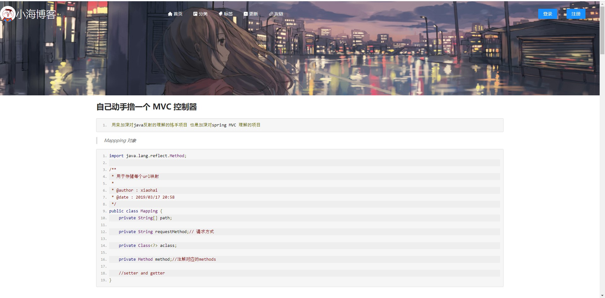
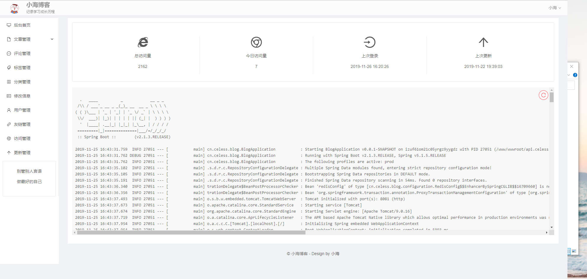
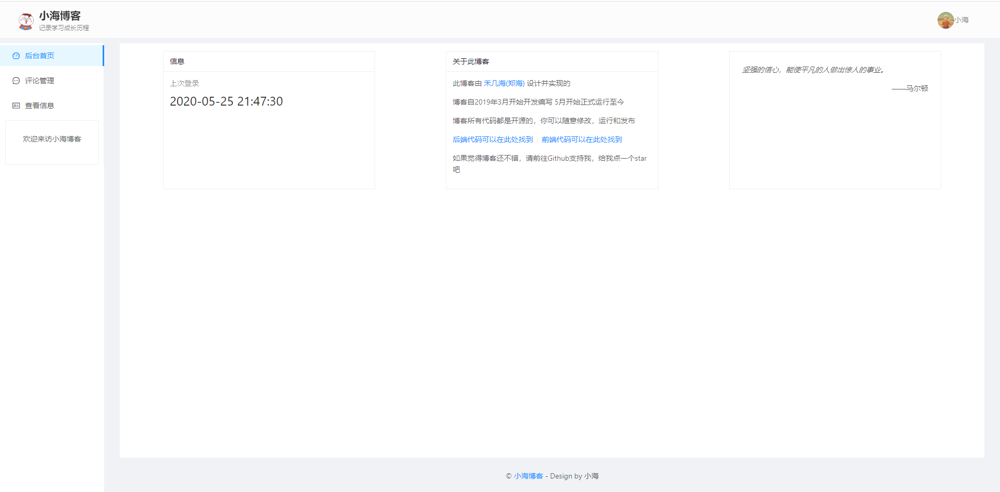
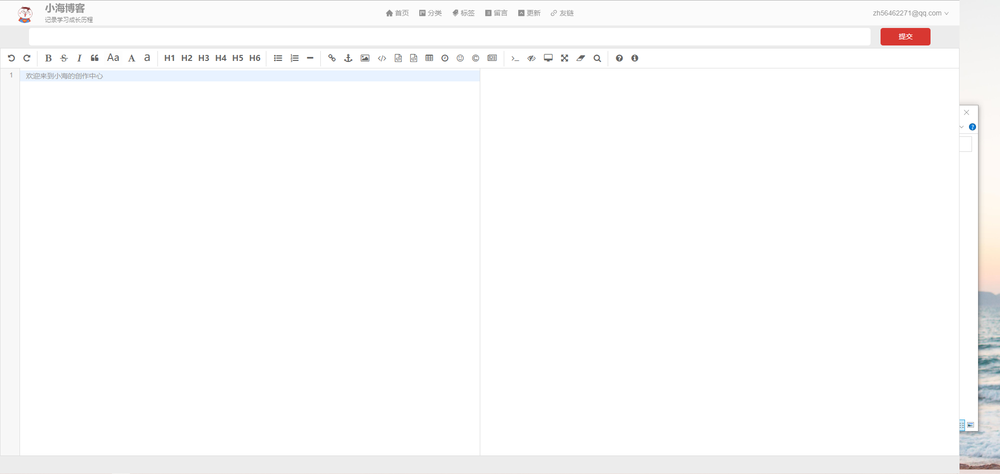

# 小海博客前端页面


基于angular的前端展示页面

#### 主要使用的技术

| 使用的技术             | 名称       |
| :--------------------- | ---------- |
| 前端框架               | angular    |
| UI库                   | ant design |
| 文章展示               | markdown   |
| markdown实现| Editor.md            |

#### 部分截图

##### 前台页面

> 首页


> 文章页



##### 后台页面

> 后台首页



> 普通用户后台



> 写作页面



> 登录页面


> 登录页面的背景图采用bing的图片，每日一更哦。 


#### 🔨构建和发布

##### 构建

>
>
> > 1. 进入index目录
> > 2. npm install
> > 3. 修改环境数据中的host
> > 
> >    -  ` /src/environments/environment.ts` (本地开发环境) 
> >    -  `/src/environments/environment-prod.ts`（线上发布环境）
> > 4. ng build --prod
>
>
>可使用项目根目录的`build.sh` 脚本进行构建，但是 两个项目中的环境里面的变量仍需自己修改
>
> 

##### 发布

- 将`index/dist/index`下的全部文件上传到网站根目录 

- 目录结构如下:

- 修改nginx的location配置 
```nginx
location / {
    try_files $uri $uri/ /index.html;
}
```
