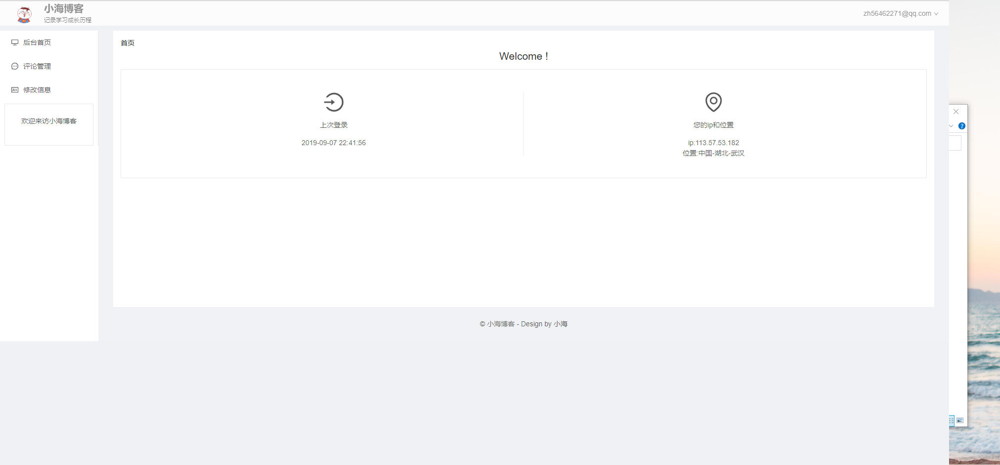
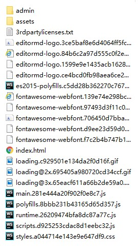

# 小海博客前端页面

基于angular的前端展示页面

#### 主要使用的技术

| 使用的技术             | 名称       |
| :--------------------- | ---------- |
| 前端框架               | angular    |
| UI库                   | ant design |
| 文章展示               | markdown   |
| markdown实现| Editor.md            |

#### 部分截图

##### 前台页面

> 首页


> 文章页


##### 后台页面

> 后台首页


> 普通用户后台



> 写作页面


#### 🔨构建和发布

##### 构建

> - index
>
> > 1. 进入index目录
> > 2. npm install
> > 3. 修改环境数据中的host
> > 
> >    -  ` /src/environments/environment.ts` (本地开发环境) 
> >    -  `/src/environments/environment-prod.ts`（线上发布环境）
> > 4. ng build --prod
>
> - admin
>
> > 1. cd admin
> > 2. npm install
> > 3. 修改环境数据中的host
> >    - ` /src/environments/environment.ts` (本地开发环境) 
> >    - `/src/environments/environment-prod.ts`（线上发布环境）
> > 4. ng build --prod
> > 5. 修改index.html将` <base href="/">`改为 ` <base href="/admin/">`
>
> 

##### 发布

- 将`index/dist/index`下的全部文件上传到网站根目录 

- 将`admin/dist/admin`文件夹上传到根目录

- 目录结构如下:

	
	
- 修改nginx的location配置 
```nginx
   	location ~ /admin/* {
	    try_files $uri $uri /admin/index.html;
 	}
    	location / {
            try_files $uri $uri/ /index.html;
  	}
```


####  📝TODO


#### 📌FIXME


